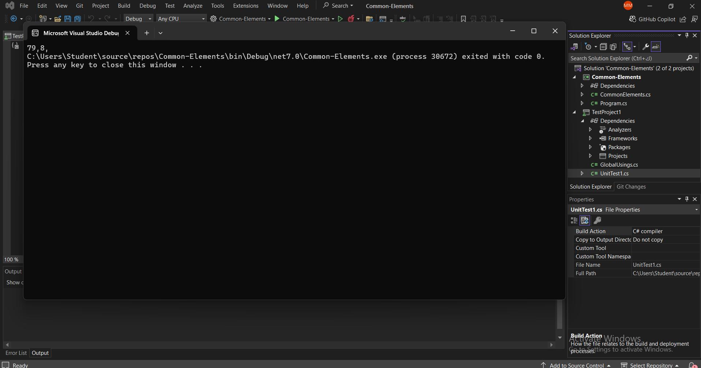

# Common Elements in an Array

## Overview

This algorithm finds common elements between two given arrays and returns them as a result array.

## Algorithm Steps

1. **Initialize**: Start by initializing necessary variables and data structures.
2. **Iterate through Arrays**: Loop through each element of the first array.
3. **Check for Common Elements**: For each element in the first array, check if it exists in the second array.
4. **Collect Common Elements**: Collect elements that appear in both arrays into a temporary array.
5. **Create Result Array**: Create a result array to store the collected common elements.

## Complexity Analysis

- **Time Complexity**: O(n * m), where n is the number of elements in the first array and m is the number of elements in the second array.
- **Space Complexity**: O(min(n, m)), where n and m are the lengths of the two input arrays.

## Example

int[] array1 = { 1, 2, 3, 0 };
int[] array2 = { 2, 3, 4, 9 };
int[] commonElements = FindCommonElements(array1, array2);
 Expected output: commonElements = [2, 3]
 ### 

