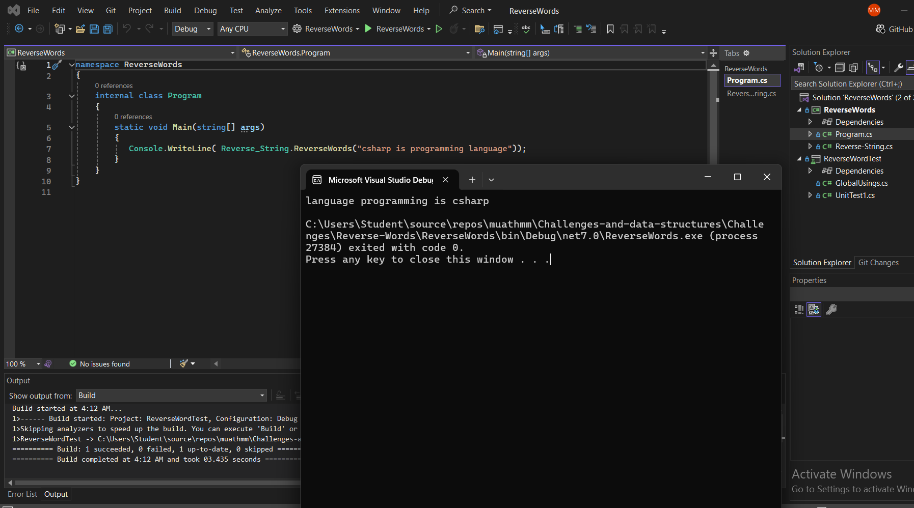

# Reverse Words in a String

## Overview

This algorithm reverses the order of words in a given string.

## Algorithm Steps

1. **Handle Empty or Whitespace Input**: Check if the input string is null or consists only of whitespace. If so, return the input as it is.
2. **Split the Input String into Words**: Initialize a list to store words. Use a loop to iterate through the input string and identify word boundaries (spaces). Add each identified word to the list.
3. **Reverse the List of Words**: Use a two-pointer technique to swap the elements in the list from both ends towards the center.
4. **Reconstruct the Result String**: Initialize an empty string for the result. Concatenate the words from the reversed list into the result string, inserting spaces as necessary.
5. **Return the Result**: Return the final string with words in reversed order.

## Complexity Analysis

- **Time Complexity**: \( O(n) \)
  - Splitting the string into words requires \( O(n) \) time, where \( n \) is the length of the input string.
  - Reversing the list of words requires \( O(m/2) \) time, where \( m \) is the number of words (which is proportional to \( n \)).
  - Reconstructing the result string requires \( O(n) \) time.
  - Overall, the time complexity is \( O(n) \).

- **Space Complexity**: \( O(n) \)
  - The space required for the list of words is proportional to the length of the input string.
  - The space required for the result string is also proportional to the length of the input string.
  - Overall, the space complexity is \( O(n) \).

## Example
string input = "Hello World";
string reversedWords = ReverseWords(input);
// Expected output: "World Hello"
 ### 