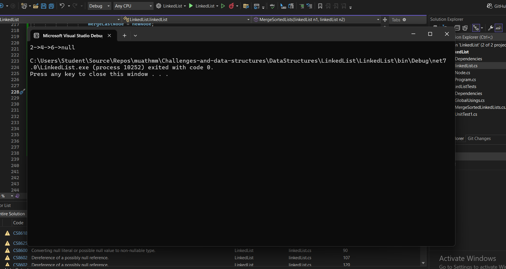

# Merge Sorted Linked Lists

## Problem Domain

Use the existing linked list implementation to add a new method, `MergeSortedLists()`, that merges two sorted linked lists into a single sorted linked list.

## Example

### Input
- List 1: 1 -> 3 -> 5 -> Null
- List 2: 2 -> 4 -> 6 -> Null

### Output
- Merged List: 1 -> 2 -> 3 -> 4 -> 5 -> 6 -> Null

### Input
- List 1: 5 -> 10 -> 15 -> Null
- List 2: 2 -> 3 -> 20 -> Null

### Output
- Merged List: 2 -> 3 -> 5 -> 10 -> 15 -> 20 -> Null

### Input
- List 1: 10 -> 20 -> 30 -> Null
- List 2: 5 -> 15 -> 25 -> 35 -> Null

### Output
- Merged List: 5 -> 10 -> 15 -> 20 -> 25 -> 30 -> 35 -> Null

## Edge Cases

- One of the lists is empty.
- Both lists are empty.
- Lists contain elements that are all greater or smaller than the other list.

## Algorithm

1. **Initialize**: Start with two pointers, `current1` and `current2`, pointing to the heads of the two lists.
2. **Merge**: Create a new linked list, `mergeNode`, to store the merged nodes.
3. **Traverse and Compare**: While both pointers are not null, compare the nodes they point to. Append the smaller node to `mergeNode` and move the corresponding pointer forward.
4. **Append Remaining Nodes**: If one list reaches the end before the other, append the remaining nodes of the other list to `mergeNode`.
5. **Return**: Return the head of the merged linked list.

## Complexity Analysis

- **Time Complexity**: O(n + m), where n and m are the lengths of the two linked lists. Each node is processed once.
- **Space Complexity**: O(1), as no additional data structures are used.

## Code

public class Node
{
    public int data;
    public Node next;
}

public class LinkedList
{
    public Node Head;

    public static LinkedList MergeSortedLists(LinkedList n1, LinkedList n2)
    {
        Node current1 = n1?.Head;
        Node current2 = n2?.Head;
        LinkedList mergeNode = new LinkedList();
        Node mergeLastNode = null;

        while (current1 != null && current2 != null)
        {
            Node newNode;
            if (current1.data < current2.data)
            {
                newNode = new Node { data = current1.data };
                current1 = current1.next;
            }
            else
            {
                newNode = new Node { data = current2.data };
                current2 = current2.next;
            }

            if (mergeNode.Head == null)
            {
                mergeNode.Head = newNode;
                mergeLastNode = newNode;
            }
            else
            {
                mergeLastNode.next = newNode;
                mergeLastNode = newNode;
            }
        }

        while (current1 != null)
        {
            Node newNode = new Node { data = current1.data };
            if (mergeNode.Head == null)
            {
                mergeNode.Head = newNode;
                mergeLastNode = newNode;
            }
            else
            {
                mergeLastNode.next = newNode;
                mergeLastNode = newNode;
            }
            current1 = current1.next;
        }

        while (current2 != null)
        {
            Node newNode = new Node { data = current2.data };
            if (mergeNode.Head == null)
            {
                mergeNode.Head = newNode;
                mergeLastNode = newNode;
            }
            else
            {
                mergeLastNode.next = newNode;
                mergeLastNode = newNode;
            }
            current2 = current2.next;
        }

        return mergeNode;
    }

    // Additional LinkedList methods (e.g., Add, Print) would be here
}

 ### 