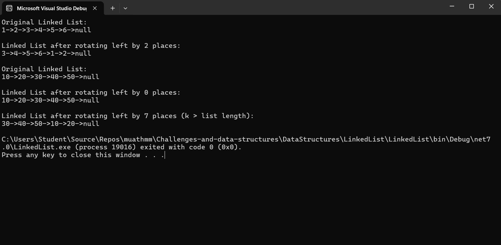

# Rotate Linked List

## Problem Description
The goal of this challenge is to rotate a singly linked list to the left by a given number `k` of places. After rotating, the node originally at position `k` becomes the new head of the list, and the remaining nodes follow.

### Example
**Input:**
Head -> 1 -> 2 -> 3 -> 4 -> 5 -> 6 -> Null, k = 2
**Output:**
Head -> 3 -> 4 -> 5 -> 6 -> 1 -> 2 -> Null

## Requirements
1. Implement the `RotateLeft(int k)` method in the `LinkedList` class.
2. Display the rotated list using the `PrintList()` method.
3. Handle edge cases such as `k = 0` or `k` being greater than the length of the list.

### Method Signature

public void RotateLeft(int k);

### console output 

