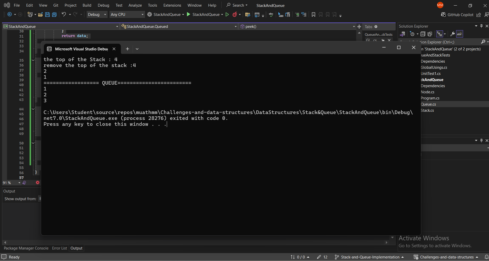

# Stack and Queue Implementation

## Problem Domain
Implement basic stack and queue data structures in C#.

## Stack Implementation
The `Stack` class supports the following methods:
- `Push(int data)`
- `Pop()`
- `Peek()`
- `IsEmpty()`

## Queue Implementation
The `Queue` class supports the following methods:
- `Enqueue(int data)`
- `Dequeue()`
- `Peek()`
- `IsEmpty()`

## Node Class
A `Node` class with properties for data and a reference to the next node.

## Example Usage
Stack stack = new Stack();
stack.Push(1);
stack.Push(2);
stack.Push(3);
Console.WriteLine(stack.Pop()); // Outputs: 3

Queue queue = new Queue();
queue.Enqueue(1);
queue.Enqueue(2);
queue.Enqueue(3);
Console.WriteLine(queue.Dequeue()); // Outputs: 1

 ### 
