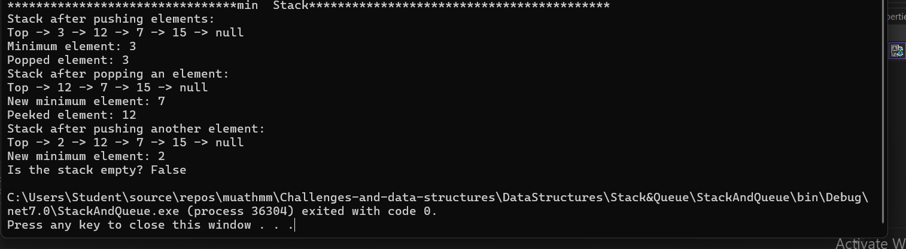

# MinStack Implementation

## Problem Domain
The `MinStack` class provides a stack data structure that supports retrieving the minimum element in constant time. The implementation leverages two stacks: one for storing the elements and another to keep track of the minimum values. This functionality is useful in scenarios where frequent retrieval of the minimum element is required while maintaining stack operations.

## Edge Cases
1. **Empty Stack**: If the stack is empty, methods like `Pop()`, `Peek()`, and `GetMin()` should handle this gracefully by throwing an appropriate exception.
2. **Single Element Stack**: If the stack contains only one element, operations such as `Pop()` and `GetMin()` should work correctly and return the same element.
3. **Pushing Elements**: Adding elements should correctly update the minimum stack to ensure that the minimum value is always accurate.

## Big O Analysis
- **Time Complexity**: O(1) for `Push()`, `Pop()`, `Peek()`, and `GetMin()`. Each operation takes constant time because the operations are performed on stacks which are LIFO (Last In, First Out) structures.
- **Space Complexity**: O(n), where n is the number of elements in the stack. This is due to the additional space required for the auxiliary stack that stores the minimum values.

## Method Implementation
### `Push(int data)`
Adds an element to the stack and updates the auxiliary stack that tracks the minimum values.

### `Pop()`
Removes and returns the top element from the stack. It also updates the auxiliary stack if the removed element was the current minimum.

### `Peek()`
Returns the top element of the stack without removing it.

### `IsEmpty()`
Checks if the stack is empty.

### `GetMin()`
Returns the minimum element in the stack by peeking into the auxiliary stack.

### `PrintStack()`

Prints the contents of the stack from top to bottom.

#### Output


#### Example Usage
```csharp
using System;

namespace StackAndQueue.Min_Stack
{
    public class MinStack
    {
        private Stack<int> stack;
        private Stack<int> minStack;

        public MinStack()
        {
            stack = new Stack<int>();
            minStack = new Stack<int>();
        }

        public void Push(int data)
        {
            stack.Push(data);
            if (minStack.Count == 0 || data <= minStack.Peek())
            {
                minStack.Push(data);
            }
        }

        public int Pop()
        {
            if (IsEmpty()) throw new InvalidOperationException("Stack is empty.");
            int poppedValue = stack.Pop();
            if (poppedValue == minStack.Peek())
            {
                minStack.Pop();
            }
            return poppedValue;
        }

        public int Peek()
        {
            if (IsEmpty()) throw new InvalidOperationException("Stack is empty.");
            return stack.Peek();
        }

        public bool IsEmpty()
        {
            return stack.Count == 0;
        }

        public int GetMin()
        {
            if (IsEmpty()) throw new InvalidOperationException("Stack is empty.");
            return minStack.Peek();
        }

        public void PrintStack()
        {
            Console.Write("Top -> ");
            foreach (var item in stack)
            {
                Console.Write($"{item} -> ");
            }
            Console.WriteLine("null");
        }
    }
}
