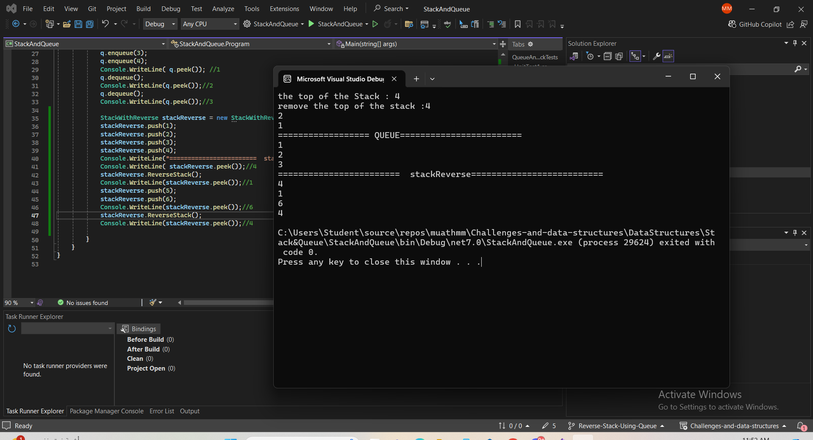

# StackWithReverse Implementation

## Problem Domain
The `StackWithReverse` class extends the basic `Stack` class and adds functionality to reverse the elements of the stack using a queue. This enhancement allows for reversing the order of elements within a stack, which can be useful in various scenarios, such as undo mechanisms or reversing data processing.

## Edge Cases
1. **Empty Stack**: If the stack is empty, the `ReverseStack` method should handle this gracefully and simply return without performing any operations.
2. **Single Element Stack**: If the stack contains only one element, reversing it should result in the same stack, and the method should handle this case without errors.
3. **Multiple Elements**: The stack should be reversed correctly, with the top element becoming the bottom element and vice versa.

## Big O Analysis
- **Time Complexity**: O(n), where n is the number of elements in the stack. The `ReverseStack` method involves transferring elements from the stack to the queue and then back to the stack, both operations taking linear time.
- **Space Complexity**: O(n), due to the additional space required by the queue to hold all the elements during the reversal process.

## Method Implementation
### `ReverseStack()`
Reverses the elements of the stack using a queue.

#### Steps:
1. **Check for Edge Cases**: If the stack is empty or has only one element, no reversal is needed.
2. **Transfer to Queue**: Pop each element from the stack and enqueue it into the queue.
3. **Transfer Back to Stack**: Dequeue each element from the queue and push it back onto the stack, effectively reversing the order.


 ### 
```
public class StackWithReverse : Stack
{
    public void ReverseStack()
    {
        if (IsEmpty() || top.Next == null)
        {
            return;
        }

        Queue queue = new Queue();

        // Transfer elements from stack to queue
        while (!IsEmpty())
        {
            queue.Enqueue(Pop());
        }

        // Transfer elements from queue back to stack
        while (!queue.IsEmpty())
        {
            Push(queue.Dequeue());
        }
    }
}


