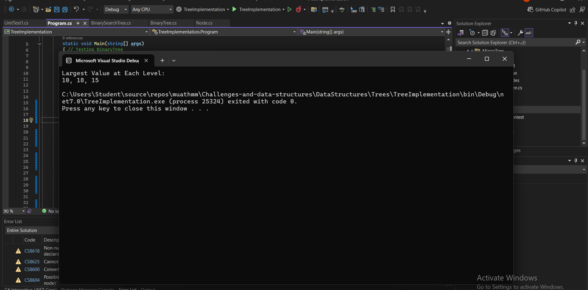

# Largest Value at Each Level
## Inputs and Expected Outputs
 ### 


## Problem Domain
Using your binary tree implementation, find the largest value at each level of the binary tree.

## Inputs and Expected Outputs
- **Input:** A binary tree.
- **Output:** A list of the largest values at each level of the binary tree.

## Edge Cases
- The tree is empty.
- The tree contains only one node.

## Visual
```text
         5
       /   \
      13    7
     / \   / \
    3   7 12  20
   / \     \
  1   4     11

   Level 0: 5
   Level 1: 13
   Level 2: 20
   Level 3: 11
