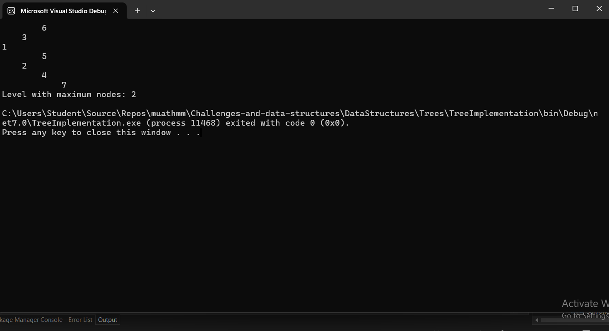

# Level with Maximum Number of Nodes

## Inputs and Expected Outputs
### 

## Problem Domain
Using your binary tree implementation, find the level in the binary tree that has the maximum number of nodes. The root of the tree is at level 0.

## Inputs and Expected Outputs
- **Input:** A binary tree.
- **Output:** The level number with the maximum number of nodes.

## Edge Cases
- The tree is empty.
- The tree contains only one node.
- All nodes are on a single level.

## Visual
```text
         1
       /   \
      2     3
     / \     \
    4   5     6
   /
  7

  Level 0: 1 node
  Level 1: 2 nodes
  Level 2: 3 nodes
  Level 3: 1 node

  Output: Level 2 (with 3 nodes)
