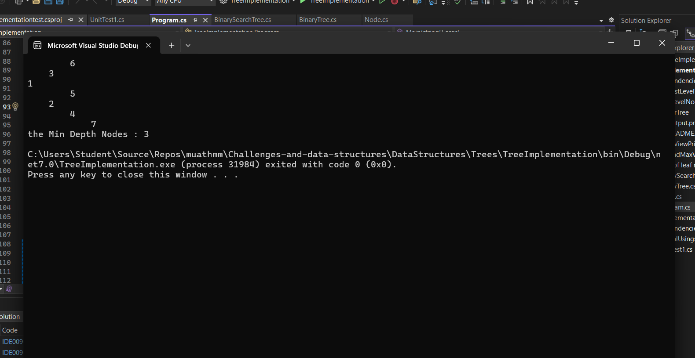

# Binary Tree - Minimum Depth Challenge

## Problem Domain

The challenge is to find the minimum depth of a binary tree. The minimum depth is defined as the number of nodes along the shortest path from the root node to the nearest leaf node. A leaf node is a node that has no children.

## Inputs and Expected Outputs
 ### 

### Example Input:
```csharp
BinaryTree Btree = new BinaryTree();
Btree.Root = new Node(1);
Btree.Root.Left = new Node(2);
Btree.Root.Right = new Node(3);
Btree.Root.Left.Left = new Node(4);
Btree.Root.Left.Right = new Node(5);
