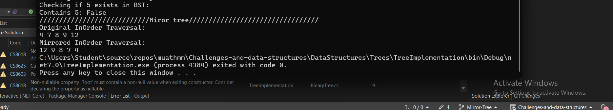

# Mirror Tree Challenge

## Problem Domain

The challenge is to convert a binary tree into its mirror tree. A mirror tree is a binary tree where all the left and right children are swapped at every node. The left subtree of the original tree becomes the right subtree in the mirror tree, and vice versa.

## Inputs and Expected Outputs
 ### 

### Example Input:
```csharp
BinaryTree Btree = new BinaryTree();
Btree.Root = new Node(4);
Btree.Root.Left = new Node(8);
Btree.Root.Right = new Node(7);
Btree.Root.Left.Left = new Node(12);
Btree.Root.Left.Right = new Node(9);
