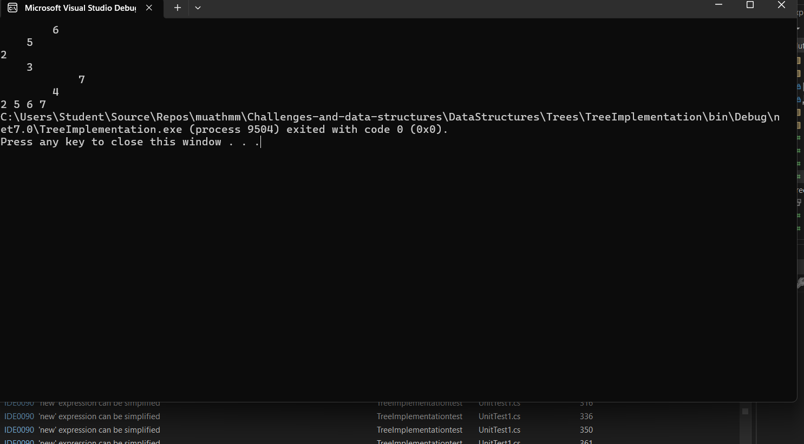

# Right View of Binary Tree

## Problem Statement

Using your binary tree implementation, print the right view of it. The right view of a binary tree is the set of nodes visible when the tree is viewed from the right side.

## Solution Approach

The `PrintRightView()` method uses level-order traversal to print the rightmost node at each level.

### Example Output

For the given tree:

###     2
 ###  /   \
 ### 3     5
### /       \
### 4         6
### \
### 7

 ### 