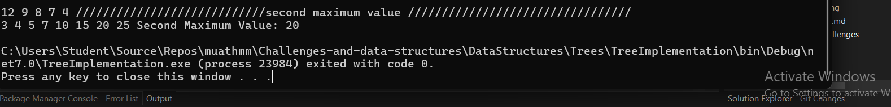

# Binary Tree Implementation

This project implements a simple **Binary Tree** in C#, with operations to insert nodes, traverse the tree, and find the second maximum value in the tree. Additionally, it includes a method to mirror the tree (i.e., swap left and right child nodes recursively).

## Features

- **Insert Values**: Add new integer values to the binary tree.
- **Tree Traversals**: Pre-order, In-order, and Post-order traversals are implemented.
- **Find Second Maximum**: A method to find the second largest value in the tree.
- **Mirror Tree**: A method to mirror (swap left and right) the entire tree.

## Classes and Methods

### `BinaryTree` Class

- **Properties**:
  - `Root`: The root node of the tree, an instance of the `Node` class.

- **Methods**:
  - `Insert(int value)`: Inserts a new value into the tree in its proper position.
  - `MirrorTree()`: Mirrors the binary tree by swapping the left and right children of every node.
  - `PreOrder(Node node)`: Traverses the tree in pre-order.
  - `InOrder(Node node)`: Traverses the tree in in-order.
  - `PostOrder(Node node)`: Traverses the tree in post-order.
  - `FindSecondMax()`: Finds and returns the second maximum value in the tree.
  - `Print()`: Prints the tree structure for visualization.

### `Node` Class

- **Properties**:
  - `Data`: Stores the value of the node.
  - `Left`: Points to the left child node.
  - `Right`: Points to the right child node.

   ## Inputs and Expected Outputs
 ### 

## Unit Tests

The project includes unit tests written with **xUnit** to verify the functionality of the tree.

### Test Cases:

1. **Finding the second maximum value**:
   - Tests finding the second maximum value in a binary tree with several nodes.
   
2. **Tree with fewer than two unique values**:
   - Verifies that an `InvalidOperationException` is thrown if the tree has fewer than two unique values.

3. **Tree with negative values**:
   - Tests that the second maximum value is correctly identified when the tree contains negative numbers.

4. **Tree with a single node**:
   - Ensures that an `InvalidOperationException` is thrown if the tree contains only one node.

5. **Empty Tree**:
   - Verifies that the method throws an exception when trying to find the second maximum value in an empty tree.

### Running the Tests

To run the tests, use the .NET CLI:

```bash
dotnet test
