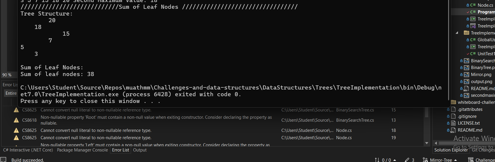

# Binary Tree Implementation

This project implements a simple **Binary Tree** in C#, with operations to insert nodes, traverse the tree, and find the second maximum value in the tree. Additionally, it includes a method to mirror the tree (i.e., swap left and right child nodes recursively) and to compute the sum of leaf nodes.

## Features

- **Insert Values**: Add new integer values to the binary tree.
- **Tree Traversals**: Pre-order, In-order, and Post-order traversals are implemented.
- **Find Second Maximum**: A method to find the second largest value in the tree.
- **Mirror Tree**: A method to mirror (swap left and right) the entire tree.
- **Sum of Leaf Nodes**: A method to compute the sum of all leaf nodes in the tree.

## Classes and Methods

### `BinaryTree` Class

- **Properties**:
  - `Root`: The root node of the tree, an instance of the `Node` class.

- **Methods**:
  - `Insert(int value)`: Inserts a new value into the tree in its proper position.
  - `MirrorTree()`: Mirrors the binary tree by swapping the left and right children of every node.
  - `PreOrder(Node node)`: Traverses the tree in pre-order.
  - `InOrder(Node node)`: Traverses the tree in in-order.
  - `PostOrder(Node node)`: Traverses the tree in post-order.
  - `FindSecondMax()`: Finds and returns the second maximum value in the tree.
  - `Print()`: Prints the tree structure for visualization.
  - `SumOfLeafNodes()`: Computes the sum of all leaf nodes in the tree.

### `Node` Class

- **Properties**:
  - `Data`: Stores the value of the node.
  - `Left`: Points to the left child node.
  - `Right`: Points to the right child node.

## Example Usage
## Inputs and Expected Outputs
 ### 

### Inserting Values

```csharp
BinaryTree tree = new BinaryTree();
tree.Insert(4);
tree.Insert(8);
tree.Insert(7);
tree.Insert(12);
tree.Insert(9);
tree.Insert(6);
tree.Insert(5);
